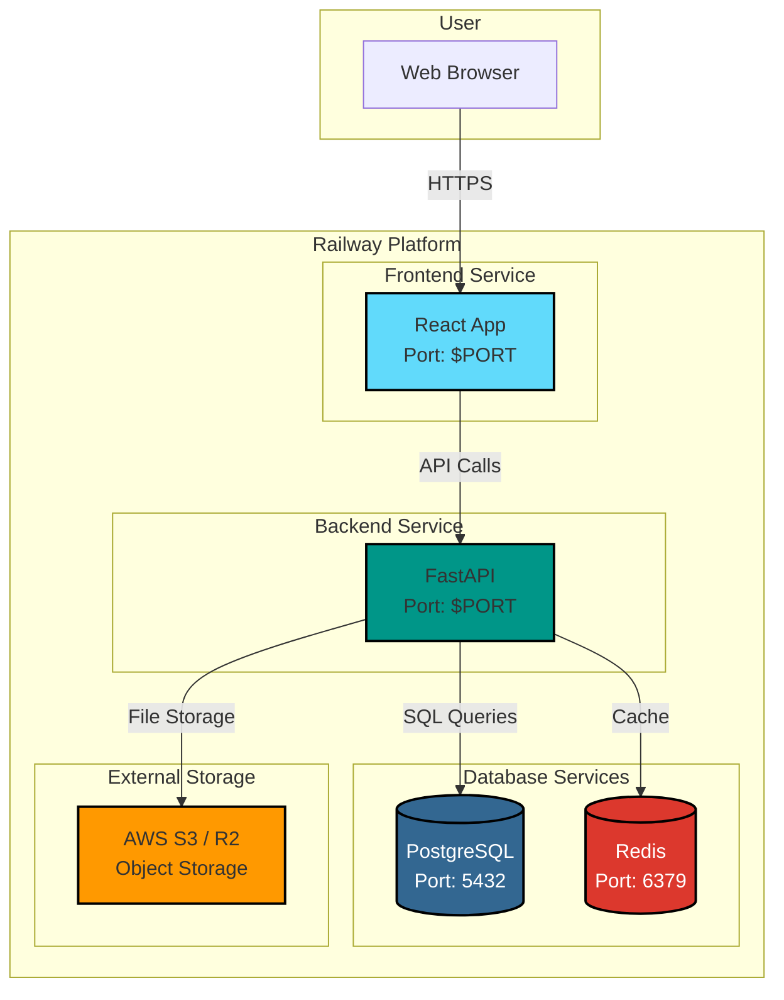

# Railway Deployment Guide for OpenBioBench

## Overview

This guide will help you deploy OpenBioBench to Railway.app with automated configuration.

## Prerequisites

- [Railway CLI](https://docs.railway.app/develop/cli) installed
- Railway account (sign up at https://railway.app)
- Git repository pushed to GitHub/GitLab

## Project Architecture on Railway

Your OpenBioBench deployment will consist of **5 services**:

1. **Backend API** - FastAPI application
2. **Frontend** - React/Vite application
3. **PostgreSQL** - Database (Railway plugin)
4. **Redis** - Cache (Railway plugin)
5. **MinIO** - Object storage (optional, can use Railway volumes or S3)

### Architecture Diagram



## Quick Deploy (Automated)

### Option 1: Using Railway CLI

```bash
# Login to Railway
railway login

# Create a new project
railway init

# Link to your GitHub repository (if not already)
railway link
```

Then deploy each service:

```bash
# Deploy Backend
cd backend
railway up

# Deploy Frontend
cd ../frontend
railway up
```

### Option 2: Using Railway Dashboard

1. Go to https://railway.app/new
2. Click "Deploy from GitHub repo"
3. Select your `OpenBioBench` repository
4. Railway will auto-detect the monorepo structure

---

## Manual Setup (Step-by-Step)

### Step 1: Create New Railway Project

```bash
railway init
# Choose: "Empty Project"
# Name it: "openbiobench"
```

### Step 2: Add Database Services

#### Add PostgreSQL

```bash
railway add --plugin postgresql
```

This will automatically create a `DATABASE_URL` environment variable.

#### Add Redis

```bash
railway add --plugin redis
```

This will automatically create a `REDIS_URL` environment variable.

---

### Step 3: Deploy Backend Service

```bash
cd backend
railway up
```

Set the following environment variables in the Railway dashboard:

**Required Variables:**

```env
# Automatically provided by Railway
DATABASE_URL=${{Postgres.DATABASE_URL}}
REDIS_URL=${{Redis.REDIS_URL}}
PORT=8000

# You must set these manually
SECRET_KEY=<generate-with-openssl-rand-hex-32>
ALGORITHM=HS256
ACCESS_TOKEN_EXPIRE_MINUTES=30

# CORS - Update after frontend is deployed
BACKEND_CORS_ORIGINS=["https://your-frontend.railway.app"]

# MinIO/S3 (if using external S3)
MINIO_ENDPOINT=s3.amazonaws.com
MINIO_ACCESS_KEY=<your-aws-access-key>
MINIO_SECRET_KEY=<your-aws-secret-key>
MINIO_BUCKET=openbiobench
MINIO_SECURE=True

# Or use Railway volumes for file storage
# (Alternative to MinIO/S3)
STORAGE_PATH=/app/storage
```

**Optional Variables:**

```env
APP_NAME=OpenBioBench
APP_VERSION=1.0.0
DEBUG=False
DATABASE_POOL_SIZE=20
REDIS_CACHE_TTL=300
MAX_UPLOAD_SIZE=104857600
JOB_TIMEOUT_SECONDS=3600
MAX_CONCURRENT_JOBS=10
```

### Step 4: Deploy Frontend Service

```bash
cd ../frontend
railway up
```

Set the following environment variable:

```env
VITE_API_URL=https://your-backend.railway.app/api
```

> **Note:** Get the backend URL from the Railway dashboard after backend deployment.

---

### Step 5: Update CORS Settings

After both services are deployed:

1. Get your frontend URL (e.g., `https://openbiobench-frontend.railway.app`)
2. Update the backend `BACKEND_CORS_ORIGINS` environment variable:
   ```env
   BACKEND_CORS_ORIGINS=["https://openbiobench-frontend.railway.app"]
   ```
3. Redeploy the backend service

---

## Environment Variables Reference

### Backend Environment Variables

| Variable                      | Required | Default | Description                                  |
| ----------------------------- | -------- | ------- | -------------------------------------------- |
| `DATABASE_URL`                | ✅       | Auto    | PostgreSQL connection string                 |
| `REDIS_URL`                   | ✅       | Auto    | Redis connection string                      |
| `SECRET_KEY`                  | ✅       | -       | JWT signing key (use `openssl rand -hex 32`) |
| `BACKEND_CORS_ORIGINS`        | ✅       | -       | List of allowed origins                      |
| `PORT`                        | ✅       | Auto    | Railway assigns this automatically           |
| `MINIO_ENDPOINT`              | ⚠️       | -       | S3/MinIO endpoint                            |
| `MINIO_ACCESS_KEY`            | ⚠️       | -       | S3/MinIO access key                          |
| `MINIO_SECRET_KEY`            | ⚠️       | -       | S3/MinIO secret key                          |
| `MINIO_BUCKET`                | ⚠️       | -       | Bucket name                                  |
| `DEBUG`                       | ❌       | False   | Enable debug mode                            |
| `ACCESS_TOKEN_EXPIRE_MINUTES` | ❌       | 30      | JWT expiration                               |

### Frontend Environment Variables

| Variable       | Required | Default | Description     |
| -------------- | -------- | ------- | --------------- |
| `VITE_API_URL` | ✅       | -       | Backend API URL |

---

## File Storage Options

### Option 1: AWS S3 (Recommended for Production)

```env
MINIO_ENDPOINT=s3.amazonaws.com
MINIO_ACCESS_KEY=<your-aws-access-key>
MINIO_SECRET_KEY=<your-aws-secret-key>
MINIO_BUCKET=openbiobench-prod
MINIO_SECURE=True
```

### Option 2: Railway Volumes

1. Create a volume in Railway dashboard
2. Mount it to `/app/storage`
3. Set environment variable:
   ```env
   STORAGE_PATH=/app/storage
   ```

### Option 3: Cloudflare R2 (S3-compatible)

```env
MINIO_ENDPOINT=<account-id>.r2.cloudflarestorage.com
MINIO_ACCESS_KEY=<your-r2-access-key>
MINIO_SECRET_KEY=<your-r2-secret-key>
MINIO_BUCKET=openbiobench
MINIO_SECURE=True
```

---

## Custom Domain Setup

### Backend Domain

1. Go to Railway dashboard → Backend service → Settings
2. Click "Custom Domain"
3. Add your domain (e.g., `api.openbiobench.com`)
4. Update DNS records as instructed
5. Update `BACKEND_CORS_ORIGINS` to include the new domain

### Frontend Domain

1. Go to Railway dashboard → Frontend service → Settings
2. Click "Custom Domain"
3. Add your domain (e.g., `openbiobench.com`)
4. Update DNS records as instructed
5. Update backend `BACKEND_CORS_ORIGINS` to include `https://openbiobench.com`

---

## Post-Deployment Testing

### 1. Check Backend Health

```bash
curl https://your-backend.railway.app/api/health
```

Expected response:

```json
{
  "status": "healthy",
  "database": "connected",
  "redis": "connected"
}
```

### 2. Test Frontend

Open your frontend URL in a browser and:

1. Sign up for a new account
2. Log in
3. Navigate to the Ligand Builder module
4. Test with SMILES: `CC(=O)Oc1ccccc1C(=O)O` (Aspirin)

### 3. Check API Documentation

Visit: `https://your-backend.railway.app/api/docs`

---

## Monitoring and Logs

### View Logs

```bash
# Backend logs
railway logs --service backend

# Frontend logs
railway logs --service frontend
```

### Metrics

Railway provides automatic metrics:

- CPU usage
- Memory usage
- Network traffic
- Request count

Access them in the Railway dashboard under each service.

---

## Database Migrations

Migrations run automatically on deployment via the `railway.json` start command:

```json
"startCommand": "alembic upgrade head && uvicorn app.main:app --host 0.0.0.0 --port $PORT"
```

To run migrations manually:

```bash
railway run alembic upgrade head
```

---

## Scaling

### Horizontal Scaling

Railway Pro plan supports multiple replicas:

1. Go to Service Settings → Scale
2. Adjust the number of replicas
3. Click "Save"

### Vertical Scaling

Railway automatically scales resources, but you can set limits:

1. Go to Service Settings → Resources
2. Set memory/CPU limits
3. Click "Save"

---

## Troubleshooting

### Backend fails to start

1. Check logs: `railway logs --service backend`
2. Verify environment variables are set
3. Check database connectivity:
   ```bash
   railway run python -c "from app.core.database import engine; print(engine)"
   ```

### Frontend can't connect to backend

1. Verify `VITE_API_URL` is set correctly
2. Check CORS settings in backend
3. Ensure backend is running

### Database migration errors

```bash
# Rollback and reapply
railway run alembic downgrade -1
railway run alembic upgrade head
```

### Out of memory errors

1. Increase memory limit in Railway dashboard
2. Optimize database pool size:
   ```env
   DATABASE_POOL_SIZE=10
   DATABASE_MAX_OVERFLOW=5
   ```

---

## Cost Optimization

### Railway Free Tier

- $5/month of free usage
- Suitable for testing and small projects

### Railway Pro Plan ($20/month)

- $20 included usage
- Better for production workloads

### Tips to Reduce Costs

1. **Use shared databases**: PostgreSQL and Redis plugins are cost-effective
2. **Optimize builds**: Cache dependencies to reduce build times
3. **Use external S3**: Cheaper than Railway volumes for large files
4. **Limit replicas**: Start with 1 replica per service
5. **Set sleep schedule**: Dev environments can sleep when not in use

---

## CI/CD Integration

### Automatic Deployments

Railway automatically deploys when you push to your main branch.

### Manual Deployments

```bash
# Deploy specific branch
railway up --branch feature/new-module

# Deploy specific environment
railway up --environment production
```

### Deployment Hooks

Add to your `railway.json`:

```json
{
  "deploy": {
    "startCommand": "alembic upgrade head && uvicorn app.main:app --host 0.0.0.0 --port $PORT",
    "healthcheckPath": "/api/health",
    "healthcheckTimeout": 100,
    "restartPolicyType": "ON_FAILURE",
    "restartPolicyMaxRetries": 10
  }
}
```

---

## Security Best Practices

1. **Use strong SECRET_KEY**: Generate with `openssl rand -hex 32`
2. **Enable HTTPS**: Railway provides automatic SSL
3. **Restrict CORS**: Only allow your frontend domain
4. **Use environment variables**: Never commit secrets to Git
5. **Enable database backups**: Available in Railway dashboard
6. **Set up monitoring**: Use Railway's built-in monitoring or integrate with Sentry

---

## Next Steps

After successful deployment:

1. ✅ Set up custom domains
2. ✅ Configure automatic backups
3. ✅ Set up monitoring and alerts
4. ✅ Enable CI/CD pipelines
5. ✅ Implement rate limiting (if needed)
6. ✅ Add analytics tracking
7. ✅ Set up error tracking (Sentry, etc.)

---

## Support and Resources

- **Railway Documentation**: https://docs.railway.app
- **Railway Discord**: https://discord.gg/railway
- **OpenBioBench Issues**: Your GitHub repository issues page
- **Railway Status**: https://status.railway.app

---

## Summary

You've successfully deployed OpenBioBench to Railway! 🎉

Your services are now live:

- **Frontend**: `https://your-frontend.railway.app`
- **Backend**: `https://your-backend.railway.app`
- **API Docs**: `https://your-backend.railway.app/api/docs`

---

**Made with ❤️ for the scientific community**
